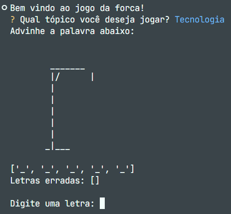

# 🎮 Jogo da Forca em Python

Um clássico jogo da forca feito em Python, com interface interativa no terminal e categorias personalizadas! Escolha um tema, tente adivinhar a palavra e veja o personagem sendo desenhado em ASCII a cada erro. Ideal para quem quer aprender jogando ou praticar lógica de programação.

## 🧠 Temas Disponíveis

- 🎮 Jogos

- 🌍 Países

- 💻 Tecnologia

As palavras são sorteadas aleatoriamente a partir de um arquivo CSV conforme o tema escolhido.

## 🛠️ Funcionalidades

- Menu interativo com InquirerPy.

- Sorteio de palavras com base no tema escolhido.

- Leitura dinâmica de palavras a partir de um arquivo CSV.

- Representação visual do boneco da forca com arte ASCII.

- Limpeza do terminal a cada jogada para uma experiência mais fluida.

## 📁 Estrutura do Projeto
```
└── dataset
    ├── game_v3.py
    └── dataset
        └── palavra_secreta.csv
```

> a pasta dataset está vazia, para você adicionar as informações que deseja

## 📦 Bibliotecas Utilizadas
- `random` – escolha aleatória da palavra.

- `pandas` – leitura do arquivo CSV com as palavras.

- `InquirerPy` – menu interativo no terminal.

- `os` – limpeza do terminal.

Para instalar as dependências:
```
pip install pandas InquirerPy
```

## 📸 Exemplo da Interface


## ▶️ Como Jogar
1. Clone o repositório:
```
git clone https://github.com/carlosvinicius-ai/Python-Projetos.git
```

2. Acesse a pasta:
```
cd DSA/cap06/projetos/projeto01
```

3. Execute o jogo:
```
python game_v3.py
```

## 🤝 Contribuições
Contribuições são muito bem-vindas! Sinta-se à vontade para:

- Abrir issues com sugestões ou bugs.

- Criar um fork e enviar um pull request com melhorias.